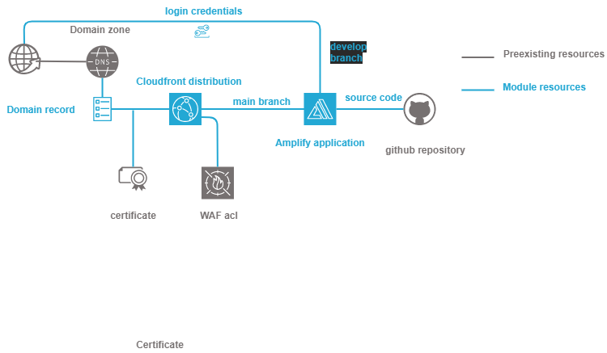

================================
Technogix docker registry module
================================

About The Project
=================

This project contains all the infrastructure as code (IaC) to deploy a secured docker repository in AWS

.. image:: https://badgen.net/github/checks/technogix-terraform/module-aws-repository
   :target: https://github.com/technogix-terraform/module-aws-repository/actions/workflows/release.yml
   :alt: Status
.. image:: https://img.shields.io/static/v1?label=license&message=MIT&color=informational
   :target: ./LICENSE
   :alt: License
.. image:: https://badgen.net/github/commits/technogix-terraform/module-aws-repository/main
   :target: https://github.com/technogix-terraform/robotframework
   :alt: Commits
.. image:: https://badgen.net/github/last-commit/technogix-terraform/module-aws-repository/main
   :target: https://github.com/technogix-terraform/robotframework
   :alt: Last commit

Built With
----------

.. image:: https://img.shields.io/static/v1?label=terraform&message=1.1.7&color=informational
   :target: https://www.terraform.io/docs/index.html
   :alt: Terraform
.. image:: https://img.shields.io/static/v1?label=terraform%20AWS%20provider&message=4.4.0&color=informational
   :target: https://registry.terraform.io/providers/hashicorp/aws/latest/docs
   :alt: Terraform AWS provider

Getting Started
===============

Prerequisites
-------------

N.A.

Configuration
-------------

To use this module in a wider terraform deployment, add the module to a terraform deployment using the following module:

.. code:: terraform

    module "repository" {

        source                  = "git::git@github.com/technogix-terraform/module-aws-repository?ref=<this module version>"
        project                 = the project to which the repository belongs to be used in naming and tags
        module                  = the project module to which the repository belongs to be used in naming and tags
        email                   = the email of the person responsible for the repository maintainance
        environment             = the type of environment to which the repository contributes (prod, preprod, staging, sandbox, ...) to be used in naming and tags
        git_version             = the version of the deployment that uses the module to be used as tag
        account                 = AWS account to allow access to root by default
        service_principal       = Technical IAM account used for automation that shall be able to access the repository
        rights                  = [ Repository access rights to add to repositories and key policies
            {
                description     = Name of the set of rules, such as AllowSomebodyToDoSomething
                actions         = [ List of allowed ecr actions, like "ecr:PutImage" for example ]
                principal       = {
                    aws         = [ list of roles and/or iam users that are allowed repository access]
                    services    = [ list of AWS services that are allowed repository access ]
                }
            }
        ]
        max_tagged_images       = Number of allowed tagged images before the older ones are removed (default 30)
        untagged_deletion_delay = Delay before untagged image are removed (default 7 days)
    }

Usage
-----

The module is deployed alongside the module other terraform components, using the classic command lines :

.. code:: bash

    terraform init ...
    terraform plan ...
    terraform apply ...

Detailed design
===============

Repository is encrypted by design.

Repository policy enables by default :

* The root user of the account

* The IAM user used to perform infrastructure deployment

to get full access to the repository, so that it can be fully managed by terraform. Additional rights are provided through module configuration

Lifecycle is set to :

* Remove untagged images after a given number of days (7 by default)

* Remove tagged images when there is more than a given number of them in the repository (30 by default)

Testing
=======

Tested With
-----------

.. image:: https://img.shields.io/static/v1?label=technogix_iac_keywords&message=v1.0.0&color=informational
   :target: https://github.com/technogix-terraform/robotframework
   :alt: Technogix iac keywords
.. image:: https://img.shields.io/static/v1?label=python&message=3.10.2&color=informational
   :target: https://www.python.org
   :alt: Python
.. image:: https://img.shields.io/static/v1?label=robotframework&message=4.1.3&color=informational
   :target: http://robotframework.org/
   :alt: Robotframework
.. image:: https://img.shields.io/static/v1?label=boto3&message=1.21.7&color=informational
   :target: https://boto3.amazonaws.com/v1/documentation/api/latest/index.html
   :alt: Boto3

Environment
-----------

Tests can be executed in an environment :

* in which python and terraform has been installed, by executing the script `scripts/robot.sh`_, or

* in which docker is available, by using the `technogix infrastructure image`_ in its latest version, which already contains python and terraform, by executing the script `scripts/test.sh`_

.. _`technogix infrastructure image`: https://github.com/technogix-images/terraform-python-awscli
.. _`scripts/robot.sh`: scripts/robot.sh
.. _`scripts/test.sh`: scripts/test.sh

Strategy
--------

The test strategy consists in terraforming test infrastructures based on the repository module and check that the resulting AWS infrastructure matches what is expected.
The tests currently contains 1 test :

1 - A test to check the capability to create multiple repositories based on the module and the terraform *count* keyword

The tests cases :

* Apply terraform to deploy the test infrastructure

* Use specific keywords to model the expected infrastructure in the boto3 format.

* Use shared ECR & KMS keywords relying on boto3 to check that the deployed infrastructure matches the expected infrastructure

NB : It is not possible to completely specify the expected infrastructure, since some of the value returned by boto are not known before apply. The comparaison functions checks that all the specified data keys are present in the output, leaving alone the other unrequired keys.

Issues
======

.. image:: https://img.shields.io/github/issues/technogix-terraform/module-aws-repository.svg
   :target: https://github.com/technogix-terraform/module-aws-repository/issues
   :alt: Open issues
.. image:: https://img.shields.io/github/issues-closed/technogix-terraform/module-aws-repository.svg
   :target: https://github.com/technogix-terraform/module-aws-repository/issues
   :alt: Closed issues

Roadmap
=======

N.A.

Contributing
============

.. image:: https://contrib.rocks/image?repo=technogix-terraform/module-aws-repository
   :alt: GitHub Contributors Image

We welcome contributions, do not hesitate to contact us if you want to contribute.

License
=======

This code is under MIT License.

Contact
=======

Technogix - contact.technogix@gmail.com

Project Link: `https://github.com/technogix-terraform/module-aws-repository`_

.. _`https://github.com/technogix-terraform/module-aws-repository`: https://github.com/technogix-terraform/module-aws-repository

Acknowledgments
===============

N.A.
