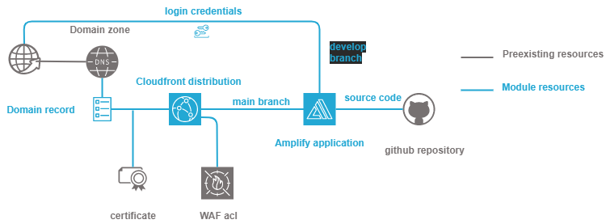

.. image:: docs/imgs/logo.png
   :alt: Logo

========================================
AWS amplify application terraform module
========================================

About The Project
=================

This project contains all the infrastructure as code (IaC) to deploy an amplify application in AWS
that automatically builds itself from a git repository

.. image:: https://badgen.net/github/checks/nadegelemperiere-aws/module-aws-amplify
   :target: https://github.com/nadegelemperiere-aws/module-aws-amplify/actions/workflows/release.yml
   :alt: Status
.. image:: https://img.shields.io/static/v1?label=license&message=MIT&color=informational
   :target: ./LICENSE
   :alt: License
.. image:: https://badgen.net/github/commits/nadegelemperiere-aws/module-aws-amplify/main
   :target: https://github.com/nadegelemperiere-aws/robotframework
   :alt: Commits
.. image:: https://badgen.net/github/last-commit/nadegelemperiere-aws/module-aws-amplify/main
   :target: https://github.com/nadegelemperiere-aws/robotframework
   :alt: Last commit

Built With
----------

.. image:: https://img.shields.io/static/v1?label=terraform&message=1.6.4&color=informational
   :target: https://www.terraform.io/docs/index.html
   :alt: Terraform
.. image:: https://img.shields.io/static/v1?label=terraform%20AWS%20provider&message=5.26.0&color=informational
   :target: https://registry.terraform.io/providers/hashicorp/aws/latest/docs
   :alt: Terraform AWS provider

Getting Started
===============

Prerequisites
-------------

N.A.

Configuration
-------------

To use this module in a wider terraform deployment, add the module to a terraform deployment using the following module:

.. code:: terraform

   module "application" {

      source                  = "git::git@github.com/nadegelemperiere-aws/module-aws-amplify?ref=<this module version>"
      project                 = the project to which the repository belongs to be used in naming and tags
      module                  = the project module to which the repository belongs to be used in naming and tags
      email                   = the email of the person responsible for the repository maintainance
      environment             = the type of environment to which the repository contributes (prod, preprod, staging, sandbox, ...) to be used in naming and tags
      git_version             = the version of the deployment that uses the module to be used as tag
      is_spa                  = true if the application is a single page application that requires specific redirect configuration
      name                    = application name
      repository              = source code repository from which the application code shall be built
      framework               = framework upon which application is built
      access_token            = access token to use to access the source code repository
      env                     = environment variables to set in the application
      acl                     = WAF acl to associate to the application distribution
      authentication          = credentials for preprod develop branch ( base64 encoded username:password string )
      domain                  = { optional setting to associate application to a domain zone
         name        = Domain name in which application shall be integrated
         subdomains  = Lists of records to create in the domain zone to link to the application
         certificate = Domain associated certificate to use for SSL communication with the record url
         zone        = Domain zone AWS identifier
      }
      logging                 = { optional but recommanded application logging configuration
         bucket      = Bucket in which application logs shall be second
         prefix      = Prefix under which the logs shall be stored
         cookies     = True if cookies shall be stored
      }
   }

Usage
-----

The module is deployed alongside the module other terraform components, using the classic command lines :

.. code:: bash

    terraform init ...
    terraform plan ...
    terraform apply ...

Detailed design
===============

The application sets up a develop branch to deploy the application for testing from the develop branch of the repository (protected with
credentials) and a main branch to deploy the application in production from the main branch. This induces constraints on the github repository
branches naming.

Testing
=======

Tested With
-----------

.. image:: https://img.shields.io/static/v1?label=aws_iac_keywords&message=v1.3.0&color=informational
   :target: https://github.com/nadegelemperiere-aws/robotframework
   :alt: AWS iac keywords
.. image:: https://img.shields.io/static/v1?label=python&message=3.10.2&color=informational
   :target: https://www.python.org
   :alt: Python
.. image:: https://img.shields.io/static/v1?label=robotframework&message=4.1.3&color=informational
   :target: http://robotframework.org/
   :alt: Robotframework
.. image:: https://img.shields.io/static/v1?label=boto3&message=1.21.43&color=informational
   :target: https://boto3.amazonaws.com/v1/documentation/api/latest/index.html
   :alt: Boto3

Environment
-----------

Tests can be executed in an environment :

* in which python and terraform has been installed, by executing the script `scripts/robot.sh`_, or

* in which docker is available, by using the `aws infrastructure image`_ in its latest version, which already contains python and terraform, by executing the script `scripts/test.sh`_

.. _`aws infrastructure image`: https://github.com/nadegelemperiere-docker/terraform-python-awscli
.. _`scripts/robot.sh`: scripts/robot.sh
.. _`scripts/test.sh`: scripts/test.sh

Strategy
--------

The test strategy consists in terraforming test infrastructures based on the repository module and check that the resulting AWS infrastructure matches what is expected.
The tests currently contains 1 test :

1 - A test to check the capability to create a simple react application

2 - A test to check the capability to create an application with authentication on the develop branch

3 - A test to check the capability to configure logging for the application access

4 - A test to check the capability to register the application in an existing route53 domain zone.

The tests cases :

* Apply terraform to deploy the test infrastructure

* Use specific keywords to model the expected infrastructure in the boto3 format.

* Use shared ECR & KMS keywords relying on boto3 to check that the deployed infrastructure matches the expected infrastructure

NB : It is not possible to completely specify the expected infrastructure, since some of the value returned by boto are not known before apply. The comparaison functions checks that all the specified data keys are present in the output, leaving alone the other unrequired keys.

Issues
======

.. image:: https://img.shields.io/github/issues/nadegelemperiere-aws/module-aws-amplify.svg
   :target: https://github.com/nadegelemperiere-aws/module-aws-amplify/issues
   :alt: Open issues
.. image:: https://img.shields.io/github/issues-closed/nadegelemperiere-aws/module-aws-amplify.svg
   :target: https://github.com/nadegelemperiere-aws/module-aws-amplify/issues
   :alt: Closed issues

Roadmap
=======

N.A.

Contributing
============

.. image:: https://contrib.rocks/image?repo=nadegelemperiere-aws/module-aws-amplify
   :alt: GitHub Contributors Image

We welcome contributions, do not hesitate to contact us if you want to contribute.

License
=======

This code is under MIT License.

Contact
=======

Nadege Lemperiere - nadege.lemperiere@gmail.com

Acknowledgments
===============

N.A.
